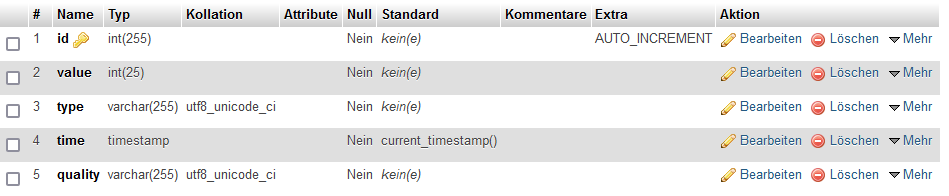
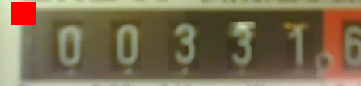

# gas_water_meter_system
A system to monitore the gas- and water meter. 


## Setup


### Mqtt Server
The System is based on python 3.7. Following packages are needed:
    <br>(is is recommenden to use a virtual envirmonment) 

- tf lite
- mysql-connector
- paho-mqtt
- opencv-python
- pytz

Additionally you need a mysql database. (e.g using xampp or set up a mysql databse on a raspberry pi) Your database should contain a table named "cam_data_gas_water_meter" with the following structure: 
 
 A mqtt broker is also needed. (e.g. install one on a raspberry pi)


After that add your network and database information into mqtt_main.py:

``` bash
    broker_address="x.x.x.x"
    mqtt_user = "user"
    mqtt_passwd = "passwd"

    server = "x.x.x.x"
    mydb = mysql.connect(
      host= server,
      user="user",
      password="paswd",
      database = "database"
    )
````

After eyerything is set up:
run mqtt_main.py

```bash
python3 mqtt_main.py
```
### Install on a raspberry pi:

If you have a Raspberry Pi Modell B+:
<br>Use the wheel file in raspi folder. Install using
(See also: https://github.com/prettyflyforabeeguy/tf_lite_on_pi_zero)

````
pip3 install "tflite_runtime-2.3.1-cp37-cp37m-linux_armv6l.whl"
````

If you have a another version of the Pi check https://pimylifeup.com/raspberry-pi-tensorflow-lite/ (not tested)

### Camera

A ESP32-Cam is used as the camera. To set up the ESP and check if it is working follow: https://draeger-it.blog/einrichten-erster-betrieb-esp32-cam/
Install required packages to use mqtt and json on the esp.

After that add your network and database information into the code for the cam:

````
const char* ssid = "";
const char* password = "";
const char* mqtt_server = "";
const char* HostName = "cam2_Gas";
const char* topic_PHOTO = "/cam2/photo";
const char* topic_CONFIG = "/cam2/setup";
const char* topic_SLEEP = "/cam2/sleep";
const char* topic_UP = "/cam2/cam";
const char* mqttUser = "";
const char* mqttPassword = "";

````

Then flash the code on the ESP32-cam.
Mount your camera, that it makes a good picture of your gas-, watermeter


## How to use

The cameras send a request to me server every 30 minutes if they should make a picture. If a picture is made it is added to the database. The picture is stored. 
<br>**That the system works properly start the Mqtt Server before starting the Cameras.**

To regocnise the numbers, these are cutted out of the image. If the settings dosn't fit to your images, adjust them. You can adjust the reference point in mqtt_main.py 
- Watermeter: dot above m^3
- Gasmeter: upper left edge (red sqare)  

Acknowledgements: [jomjol](https://github.com/jomjol/water-meter-system-complete) The model trained by jomjol is used to recognise the numbers and analog neddles.
 


